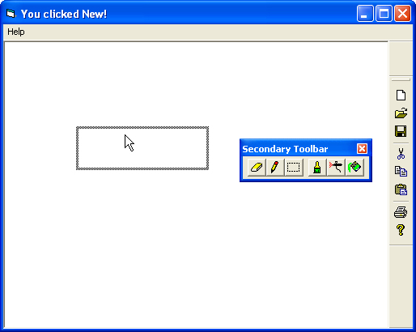



## Docking Toolbars

### Description

Create real docking toolbars in your Visual Basic applications. Just the way they are in professional applications.

This code has been converted from Microsoft Foundation Classes (MFC) for Visual C++ 6.0.
 
### More Info
 

             |
---                |---
**Submitted On**   |2006-08-11 14:57:12
**By**             |[Shaurya Malhotra](https://github.com/Planet-Source-Code/PSCIndex/blob/master/ByAuthor/shaurya-malhotra.md)
**Level**          |Advanced
**User Rating**    |4.9 (64 globes from 13 users)
**Compatibility**  |VB 6\.0
**Category**       |[Custom Controls/ Forms/  Menus](https://github.com/Planet-Source-Code/PSCIndex/blob/master/ByCategory/custom-controls-forms-menus__1-4.md)
**World**          |[Visual Basic](https://github.com/Planet-Source-Code/PSCIndex/blob/master/ByWorld/visual-basic.md)
**Archive File**   |[Docking\_To2050802282007\.zip](https://github.com/Planet-Source-Code/shaurya-malhotra-docking-toolbars__1-68013/archive/master.zip)

